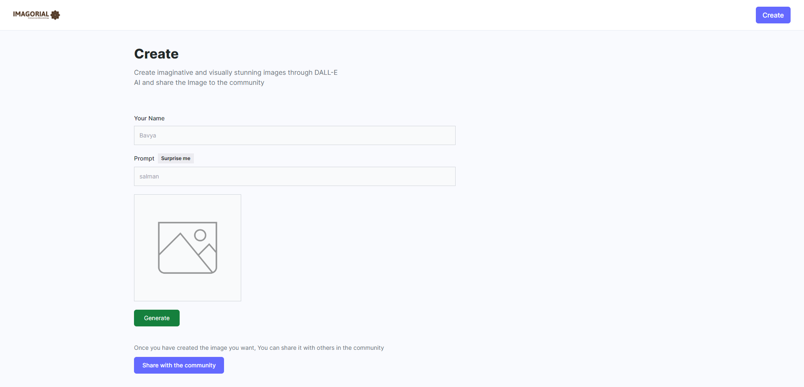

# Project Title: Image Generation using Artificial Intelligence: 

## Project Description: 
***
This Project is Developed using Dall-E API Developed by Open AI Organization. In this Project we can Create imaginative AI generated Images 

*** 
## To run this Project: 

* To run this Project you should have Good knowledge at React and nodejs 
* First download the Nodejs and add the path to environmental in your system. 


* Then clone the repository and run. 

*** 

#### Run this comand for the client side 

```command

    npm run dev 

```

*** 

Run this command to run the server side 

```command
    npm start 

```

*** 

### Output:


***




*** 


